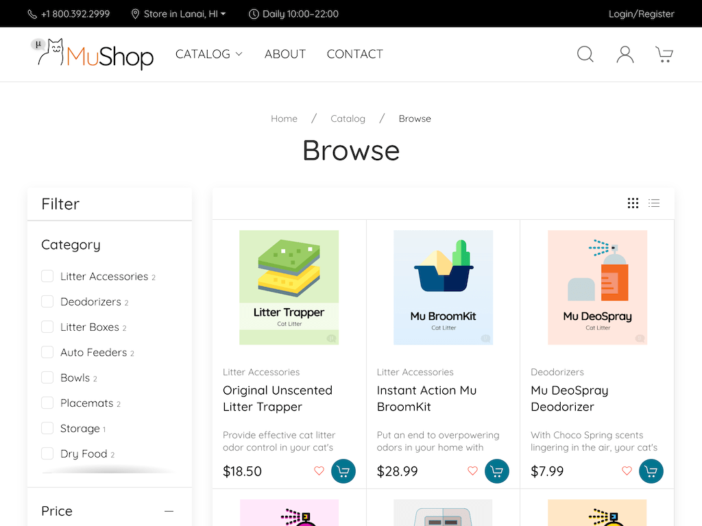

# Oracle Resource Manager on OCI Hands-On

 
## Introduction
본 핸즈온 문서는 Oracle Resource Manager와 Terraform Configuration을 사용하여 간단한 샘플 웹 애플리케이션 운영을 위한 배포 환경을 Oracle Cloud Infrastructure 환경에 자동으로 구성하고 배포하는 과정을 다루고 있습니다. 본 과정을 통해서 기본적인 오라클 클라우드 인프라 구성을 위한 서비스 리소스와 Terraform 코드를 통해 Oracle Cloud 인프라 구성 및 애플리케이션 배포를 자동화 해보는 경험을 해볼 수 있습니다.

## Objectives
* Oracle Cloud Infrastructure 리소스 이해
* Oracle Resource Manager 및 Terraform Configuration 이해
* Oracle REsource Manager Stack 생성 코드 작성
* Oracle Resource Manager Job 실행

## 샘플 애플리케이션
샘플 애플리케이션은 MuShop 이라는 이름을 가진 이커머스 웹 사이트(고양이 관련 용품 판매)로 3-tier로 구성된 웹 애플리케이션입니다.
해당 애플리케이션에는 애플리케이션 구동에 필요한 모든 리소스와 설정을 담고 있는 Terraform 코드를 포함하고 있습니다.

|  |  |  |  |
|---|---|---|---|

## Required Artifacts
* 인터넷 접속 가능한 랩탑
* OCI (Oracle Cloud Infrastructure) 계정
* SSH Terminal (windows Putty, macOS Terminal 등)

## Client 접속 환경
ssh -i mcd_id_rsa opc@132.145.80.104

## Hands-On Steps

* **STEP 1**: Setup  
* **STEP 2**: OCI에서 Kubernetes Cluster 생성하기  
* **STEP 3**: kubectl과 oci-cli 설치하기  
* **STEP 4**: GitHub Repository 생성하기  
* **STEP 5**: Wercker 환경 구성하기  
* **STEP 6**: Wercker CI/CD Pipeline 구성하기  
* **STEP 7**: Wercker 파이프라인 실행하기  
* **STEP 8**: Oracle Container Registry (OCIR) 확인 및 Oracle Kubernetes Engine (OKE) 에 생성(배포)된 Pod와 Service 확인하기  
* **STEP 9**: Oracle Kubernetes Engine (OKE) 에 생성(배포)된 Pod와 Service 확인하기  
* **STEP 10**: 서비스 확인하기

***

## **STEP 1**: Setup
* GitHub 계정 생성
* Wercker 계정 생성

### GitHub 계정 생성
* https://github.com 에 접속해서 우측 상단 **Sign up**을 클릭합니다.

* 다음 내용을 입력하고 **Create an account** 클릭해서 계정 생성합니다. 검증 메일이 발송되기 때문에 정확한 이메일을 입력해야 합니다. GitHub으로 부터 수신받은 이메일에서 **Verify email address**를 클릭해서 계정 생성을 완료합니다.

    

    

* 생성한 계정으로 **Sign in** 합니다.

    

    